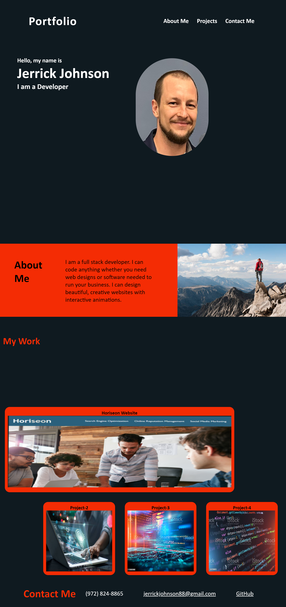

# JerricksProPortfolio
# Jerrick Johnson's Portfolio

## Desctiption
 I built a professional portfolio showcasing the skills and techniques I have acquired. This will be instrumental in showing my skills for future employers. Within the porfolio I have links up at the top of my page, About Me, My Work, and Contact. When link is pushed the user will be automatically scrolled to the link of their choice. There is a portrait picture of me at the top of the application, then a section about me, followed by a My Work section showcasing my projects with the first main project shown larger then the others. When the pointer hovers over the project images or links the box will have an enlargement mechanic. At the bottom of the site there is a Contact section that gives the user my contact information, phone number, email and link to my GitHub. 

## Assets

The following image demonstrates the web application's appearance and functionality:

## The URL of the deployed application:

https://jerrickjohnson.github.io/MyPortfolio/

## The URL of the GitHub repository:

https://github.com/JerrickJohnson/MyPortfolio